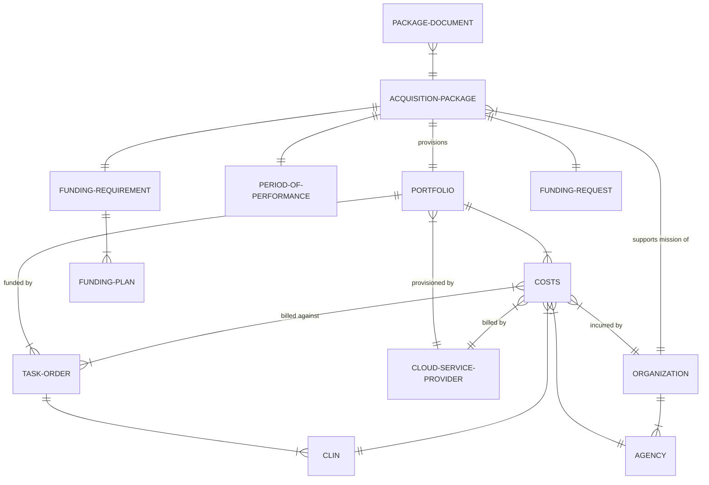

### Entity-Relationship Diagram (ERD)

This diagram is simplified to emphasize core business entities and their relationships. See Relational Model for details.



### Relational Model Diagram

This diagram depicts the relational model as implemented in ServiceNow tables in full detail.

```mermaid
erDiagram
    %% Portfolio
    ALERT {
        GUID sys_id PK
        Reference portfolio FK "to Portfolio"
        Reference task_order FK "to Task Order"
        Reference clin FK "to CLIN"
        Boolean active
        Choice alert_type "SPENDING_ACTUAL/SPENDING_FORECAST/TIME_REMAINING"
        String threshold_violation_amount
        DateTime last_notification_date
    }
    PORTFOLIO {
        GUID sys_id PK
        Reference acquisition_package FK "to Acquisition Package"
        Reference active_task_order FK "to Task Order"
        Reference csp FK "to Cloud Service Provider"
        List pending_operators FK "to Operator"
        String csp_portfolio_id "from CSP"
        URL dashboard_link "deep link to CSP"
        DateTime last_updated
        String name
        Choice portfolio_funding_status "ON_TRACK/AT_RISK/FUNDING_AT_RISK/EXPIRED/DELINQUENT/EXPIRING_SOON"
        List portfolio_managers "to sys_user"
        List portfolio_viewers "to sys_user"
        Choice portfolio_status "ACTIVE/ARCHIVED/PROCESSING"
        Boolean provisioned
        DateTime provisioned_date
        String provisioning_failure_cause
        DateTime provisioning_request_date
    }
    TASK-ORDER {
        GUID sys_id PK
        Reference portfolio FK "to Portfolio"
        Reference acquisition_package FK "to Acquisition Package"
        Reference funding_plan FK "to Funding Plan"
        Reference funding_request FK "to Funding Request"
        List clins FK "to CLIN"
        String task_order_number
        Choice task_order_status "ON_TRACK/AT_RISK/EXPIRED/UPCOMING"
        Date pop_start_date
        Date pop_end_date
        Currency funds_total
        Currency funds_obligated
        Choice incrementally_funded "Y/N"
    }
    CLIN {
        GUID sys_id PK
        Reference task_order FK "to Task Order"
        String clin_number
        Choice clin_status
        Choice idiq_clin
        Date pop_start_date
        Date pop_end_date
        Currency funds_total
        Currency funds_obligated
    }
    CLOUD-SERVICE-PROVIDER {
        GUID sys_id PK
        String name
        Choice network
        String uri "TODO change to URL type?"
        URL pricing_calculator_uri
    }
    COSTS {
        GUID sys_id PK
        Reference clin FK "to CLIN"
        Reference csp FK "to Cloud Service Provider"
        Reference portfolio FK "to Portfolio"
        Reference organization FK "to Organization"
        Reference agency FK "to Agency"
        String task_order_number
        Boolean is_actual "actual/forecast"
        Currency value
        Date year_month "ignore day"
    }
    AGENCY {
        GUID sys_id PK
        Integer css_id "Contract Support System"
        String label
        String title
        String acronym
    }
    OPERATOR {
        GUID sys_id PK
        Reference portfolio FK "to Portfolio"
        String dod_id
        String email
        Boolean needs_reset
        Boolean provisioned
        DateTime provisioning_request_date
        DateTime provisioned_date
        String provisioning_failure_cause
        String added_by
    }
    PORTFOLIO ||--|{ TASK-ORDER : "funded by"
    TASK-ORDER ||--|{ CLIN : "has (from EDA)"
    CLIN }|--|| TASK-ORDER : "part of"
    PORTFOLIO ||--|{ COSTS : "has (from CSPs)"
    PORTFOLIO ||--|{ SYS_USER : "portfolio managers and viewers"
    PORTFOLIO ||--|{ OPERATOR : "pending operators"
    PORTFOLIO }|--|| CLOUD-SERVICE-PROVIDER : "provisioned by"
    COSTS }|--|| CLIN : ""
    COSTS }|--|| CLOUD-SERVICE-PROVIDER : "billed by"
    COSTS }|--|{ TASK-ORDER : "billed against"
    COSTS }|--|| ORGANIZATION : "incurred by"
    COSTS }|--|| AGENCY : ""
    ALERT }|--|| PORTFOLIO : ""
    ALERT }|--|| TASK-ORDER : ""
    ALERT }|--|| CLIN : "relates to"

    %% Package
    DITCO-CONTRACT-SPECIALIST {
        GUID sys_id PK
        Reference user FK "to sys_user"
        String first_name
        String last_name
        Boolean is_ko
        Integer css_id "Contract Support System"
    }
    IDIQ-CLIN {
        GUID sys_id PK
        Reference classification_level FK "to Classification Level"
        Choice contract "JWCC"
        Choice contract_type "FFP/T&M"
        String description
        String idiq_clin
    }
    ACQUISITION-PACKAGE {
        GUID sys_id PK
        Reference classification_level FK "to Classification Level"
        Reference contract_award FK "to Award History"
        Reference contract_considerations FK "to Contract Considerations"
        List contract_modifications FK "to Award History"
        Reference contract_type FK "to Contract Type"
        List contributors FK "to sys_user"
        List mission_owners FK "to sys_user"
        Reference current_contract_and_recurring_information FK "to Current Contract Information And Recurring Information"
        Reference current_environment FK "to Current Environment"
        Reference ditco_ko FK "to DITCO Contract Specialist"
        Reference fair_opportunity FK "to Fair Opportunity"
        List funding_plans FK "to Funding Plan"
        Reference funding_request FK "to Funding Request"
        Reference funding_requirement FK "to Funding Requirement"
        Reference gfe_overview FK "TODO delete table"
        List idiq_clins FK "to IDIQ CLIN"
        Reference organization FK "to Organization"
        List pending_operator FK "to Operator"
        Reference period_of_performance FK "to Period of Performance"
        Reference ditco_cs FK "to DITCO Contract Specialist"
        Reference project_overview FK "to Project Overview"
        Reference requirements_cost_estimate FK "to Requirements Cost Estimate"
        List secondary_reviewers FK "to sys_user"
        List selected_service_offerings FK "to Selected Service Offering"
        Reference sensitive_information FK "to Sensitive Information"
        String number
        Choice package_status "DRAFT/WAITING_FOR_SIGNATURES/WAITING_FOR_TASK_ORDER/TASK_ORDER_AWARDED/ARCHIVED/DELETED"
        String css_pre_award_id "Contract Support System"
        String css_tracking_number "Contract Support System"
        String docusign_envelope_id
        Boolean edms_folder_created "Electronic Document Management System"
    }
    PROJECT-OVERVIEW {
        GUID sys_id PK
        String title
        Boolean emergency_declaration
        String scope
    }
    CONTACTS {
        GUID sys_id PK
        Reference rank_components FK "to Military Rank"
        Choice type "MISSION_OWNER/COR/ACOR/FINANCIAL_POC/JWCC_CONTRACTING_OFFICER"
        Boolean can_access_package "Y/N; defined here"
        String salesforce_record_id
        Choice grade_civ "GS-01:15/SES"
        Choice role "CIVILIAN/CONTRACTOR/MILITARY"
        String dodaac
        String email
        String title
        Choice salutation "MR/MRS/MS/MISS/DR"
        String first_name
        String middle_name
        String last_name
        String suffix
        String formal_name "calculated value"
        PhoneNumber phone
        String phone_extension
        String phone_and_extension "calculated value"
        Boolean manually_entered
    }
    MILITARY-RANK {
        GUID sys_id PK
        String name
        String abbreviation
        Choice grade "E-1:9/O-1:10/W-1:5"
        Choice branch "AIR_FORCE/ARMY/COAST_GUARD/MARINE_CORPS/NAVY/SPACE_FORCE"
    }
    PROVISIONING-JOB {
        GUID sys_id PK
        Reference acquisition_package FK "to Acquisition Package"
        Choice job_type "ADD_PORTFOLIO/ADD_OPERATORS/ADD_FUNDING_SOURCE"
        String payload
        Choice status "NOT_STARTED/IN_PROGRESS/SUCCESS/FAILURE"
        String status_message
    }
    ORGANIZATION {
        GUID sys_id PK
        Reference agency FK "to Agency"
        String computed_name "calculated value"
        Choice disa_organization "> 50 options"
        String organization_name "when non-DISA"
        String dodaac
        Choice address_type "US/MILITARY/FOREIGN"
        String street_address_1
        String street_address_2
        String city
        String state
        String zip_code
        String country
    }
    SENSITIVE-INFORMATION {
        GUID sys_id PK
        String foia_full_name "Freedom of Information Act (FOIA) Coordinator"
        String foia_email
        String accessibility_reqs_508
        Choice section_508_sufficient
        String system_of_record_name
        Choice potential_to_be_harmful "if disclosed"
        Choice pii_present
        Choice baa_required "Business Associate Agreement"
        Choice foia_address_type "FOREIGN/MILITARY/US"
        String foia_state_province_state_code
        String foia_street_address_1
        String foia_street_address_2
        String foia_city_apo_fpo
        String foia_country
        String foia_zip_postal_code
        String work_to_be_performed
    }
    AWARD-HISTORY {
        GUID sys_id PK
        Choice contract_award_type "INITIAL_AWARD/MODIFICATION"
        Date effective_date
        Integer modification_order
    }
    CONTRACT-CONSIDERATIONS {
        GUID sys_id PK
        String conflict_of_interest_explanation
        NameValuePairs required_training_courses
        Choice potential_conflict_of_interest
        String packaging_shipping_other_explanation
        Boolean packaging_shipping_other
        Boolean packaging_shipping_none_apply
        Choice contractor_required_training
        Boolean contractor_provided_transfer
    }
    CONTRACT-TYPE {
        GUID sys_id PK
        String contract_type_justification "if FFP"
        Boolean firm_fixed_price
        Boolean time_and_materials
    }
    CURRENT-CONTRACT-INFORMATION-AND-RECURRING-INFORMATION {
        GUID sys_id PK
        String incumbent_contractor_name
        String contract_number
        Choice current_contract_exists
        Date contract_order_expiration_date
        String task_delivery_order_number
    }
    PERIOD-OF-PERFORMANCE {
        GUID sys_id PK
        Reference base_period FK "to Period"
        List option_periods FK "to Period"
        Date requested_pop_start_date
        Choice recurring_requirement
        Choice pop_start_request
        Choice time_frame
    }
    FAIR-OPPORTUNITY {
        GUID sys_id PK
        Choice exception_to_fair_opportunity
    }
    FUNDING-PLAN {
        GUID sys_id PK
        List remaining_amount_increments FK "to Funding Increment"
        FileAttachment attachment
        String extension
        String file_name
        Currency initial_amount
        Currency remaining_amount
        Currency estimated_task_order_value
        String schedule_text "calculated value"
    }
    FUNDING-REQUEST {
        GUID sys_id PK
        Reference fs_form FK "to Funding Request FS Form"
        Reference mipr FK "to Funding Request MIPR"
        Choice funding_request_type "FS_FORM/MIPR"
    }
    FUNDING-REQUEST-FS-FORM {
        GUID sys_id PK
        FileAttachment fs_form_7600a_attachment
        String fs_form_7600a_filename
        FileAttachment fs_form_7600b_attachment
        String fs_form_7600b_filename
        String gt_c_number "General Terms and Condition"
        String order_number
        Choice use_g_invoicing
    }
    FUNDING-REQUEST-MIPR {
        GUID sys_id PK
        FileAttachment mipr_attachment
        String mipr_filename
        String mipr_number
    }
    FUNDING-REQUIREMENT {
        GUID sys_id PK
        Reference acquisition_package FK "to Acquisition Package"
        Reference funding_plan FK "to Funding Plan"
        Reference funding_request FK "to Funding Request"
        Currency funds_obligated
        Currency funds_total
        Choice incrementally_funded
        Date pop_end_date
        Date pop_start_date
        String task_order_number
    }
    FUNDING-INCREMENT {
        GUID sys_id PK
        Currency amount
        String description
        Integer order
    }
    GFE-OVERVIEW {
        GUID sys_id PK
        String property_custodian_name
        String dpas_custodian_number "Defense Property Accountability System"
        Choice property_accountable
        Choice gfe_gfp_furnished
        String dpas_unit_identification_code
    }
    PERIOD {
        GUID sys_id PK
        Choice period_type "BASE/OPTION"
        Integer period_unit_count
        Choice period_unit "DAY/WEEK/MONTH/YEAR"
        Integer option_order
    }
    REQUIREMENTS-COST-ESTIMATE {
        GUID sys_id PK
        String surge_capabilities
        Integer contracting_office_fee_pct
    }
    SERVICE-OFFERING {
        GUID sys_id PK
        String description
        Choice service_offering_group
        Integer sequence
        String name
    }
    SELECTED-SERVICE-OFFERING {
        GUID sys_id PK
        List classification_instances FK "to Classification Instance"
        List estimated_environment_instances FK "to Estimated Environment Instance"
        Reference service_offering FK "to Service Offering"
        String other_service_offering
    }
    ESTIMATED-ENVIRONMENT-INSTANCE {
        Extends ENVIRONMENT-INSTANCE "inherits cols"
        GUID sys_id PK
        String dow_task_number
        Currency monthly_price
    }
    CURRENT-ENVIRONMENT-INSTANCE {
        Extends ENVIRONMENT-INSTANCE "inherits cols"
        List deployed_regions FK "to Region"
        Choice current_usage_description "EVEN_USAGE/IRREGULAR_USAGE"
        Choice is_traffic_spike_event_based "Y/N"
        Choice is_traffic_spike_period_based "Y/N"
        String traffic_spike_event_description
        String traffic_spike_period_description
        String users_per_region "stringified json obj w/ sys_id:count pairs"
        Choice operating_type "DEV_TESTING/PREPRODUCTION/PRODUCTION/COOP_DISASTERRECOVERY"
        Choice operating_environment "VM/CONTAINERS/SERVERLESS/VIRTUAL_DESKTOP"
        String anticipated_need_usage
        String additional_information
    }
    DATABASE-ENVIRONMENT-INSTANCE {
        Extends ENVIRONMENT-INSTANCE "inherits cols"
        Choice database_type "ANALYTICAL/TRANSACTIONAL/GRAPH/RELATIONAL/OTHER"
        String database_type_other
        Choice database_licensing "TRANSFER_EXISTING/NEW"
    }
    CLASSIFICATION-INSTANCE {
        GUID sys_id PK
        Reference classification_level FK "to Classification Level"
        List selected_periods FK "to Period"
        String dow_task_number
        Currency monthly_price
        Choice need_for_entire_task_order_duration
        String usage_description
    }
    CLASSIFICATION-LEVEL {
        GUID sys_id PK
        Choice classification "U/S/TS"
        Choice impact_level "IL2/IL4/IL5/IL6"
        String display "calculated value"
    }
    REGION {
        GUID sys_id PK
        String description
        Choice group "CONUS/OCONUS"
        String name
        Integer sequence
    }
    ENVIRONMENT-INSTANCE {
        GUID sys_id PK
        Reference classification_level FK "to Classification Level"
        List selected_periods FK "to Period"
        Reference region FK "to Region"
        Choice need_for_entire_task_order_duration "true=select all periods"
        String instance_name
        Choice instance_location "CLOUD/ON_PREM"
        Integer number_of_instances "how many currently / are needed"
        String operating_system
        String licensing
        Choice pricing_model "PREPAID/PAY_AS_YOU_GO"
        Date pricing_model_expiration
        Choice performance_tier "GENERAL/COMPUTE/MEMORY/STORAGE"
        Integer number_of_vcpus
        Integer processor_speed
        Integer memory_amount
        Choice memory_unit "GB/TB/PB"
        Choice storage_type "BLOCK/OBJECT/FILE/ARCHIVE"
        Integer storage_amount
        Choice storage_unit "GB/TB/PB; defined here"
        Integer data_egress_monthly_amount
        Choice data_egress_monthly_unit "GB/TB/PB"
    }
    CURRENT-ENVIRONMENT {
        GUID sys_id PK
        List env_instances FK "to Current Environment Instance"
        List system_documentation FK "to sys_attachment"
        List env_classifications_cloud FK "to Classification Level"
        List env_classifications_onprem FK "to Classification Level"
        List migration_documentation FK "to sys_attachment"
        List data_classifications_impact_levels FK "to Classification Level"
        Choice current_environment_exists "Y/N"
        Choice has_system_documentation "Y/N"
        Choice has_migration_documentation "Y/N"
        Choice env_location "CLOUD/ON_PREM/HYBRID"
        Choice current_environment_replicated_optimized "YES_REPLICATE/YES_OPTIMIZE/NO"
        String statement_replicated_optimized
        Choice additional_growth "Y/N"
        Integer anticipated_yearly_additional_capacity
        Choice has_phased_approach "Y/N"
        String phased_approach_schedule
        Choice needs_architectural_design_services "Y/N"
        String statement_architectural_design
        String applications_need_architectural_design
        String external_factors_architectural_design
    }
    PACKAGE-DOCUMENT {
        GUID sys_id PK
        Reference acquisition_package FK "to Acquisition Package"
        Reference document_type FK "to Package Document Type"
        FileAttachment file
        Choice document_status "DRAFT/READY_FOR_REVIEW/ACTION_REQUESTED/COMPLETED"
    }
    PACKAGE-DOCUMENT-TYPE {
        GUID sys_id PK
        Choice contract "JWCC"
        String name
        String abbreviation
        String file_name
        String edms_document_type
    }
    UPDATE-SALESFORCE-COR-ACOR-CONTACT {
        GUID sys_id PK
        String request_body
    }
    ATAT-CONFIGURATION {
        GUID sys_id PK
        String description
        String name
        String value
    }
    ENVIRONMENT-CONFIG {
        GUID sys_id PK
        URL endpoint
        String name
    }

    ACQUISITION-PACKAGE ||--|| SYS_USER : "MOs, contributors, reviewers"
    ACQUISITION-PACKAGE }|--|| CLASSIFICATION-LEVEL : ""
    ACQUISITION-PACKAGE ||--|| PORTFOLIO : "generates"
    ACQUISITION-PACKAGE ||--|| PROJECT-OVERVIEW : ""
    ACQUISITION-PACKAGE }|--|{ CONTACTS : "m2m table omitted"
    CONTACTS ||--o| MILITARY-RANK : "military have"
    ACQUISITION-PACKAGE }|--|| ORGANIZATION : "supports mission of"
    ORGANIZATION ||--|{ AGENCY : ""
    ACQUISITION-PACKAGE ||--|{ PROVISIONING-JOB : ""
    ACQUISITION-PACKAGE ||--|| SENSITIVE-INFORMATION : ""
    ACQUISITION-PACKAGE ||--|{ AWARD-HISTORY : "award and mods"
    ACQUISITION-PACKAGE ||--|| CONTRACT-CONSIDERATIONS : ""
    ACQUISITION-PACKAGE }|--|| CONTRACT-TYPE : ""
    ACQUISITION-PACKAGE ||--|| CURRENT-CONTRACT-INFORMATION-AND-RECURRING-INFORMATION : ""
    ACQUISITION-PACKAGE ||--|| PERIOD-OF-PERFORMANCE : ""
    ACQUISITION-PACKAGE ||--|| FAIR-OPPORTUNITY : ""
    ACQUISITION-PACKAGE ||--|| GFE-OVERVIEW : "TODO delete table"
    PERIOD-OF-PERFORMANCE ||--|{ PERIOD : "base and option"
    ACQUISITION-PACKAGE ||--|| REQUIREMENTS-COST-ESTIMATE : ""
    ACQUISITION-PACKAGE }|--|{ DITCO-CONTRACT-SPECIALIST : "KO and CS"
    DITCO-CONTRACT-SPECIALIST ||--|| SYS_USER : "KO and CS"
    ACQUISITION-PACKAGE }|--|{ IDIQ-CLIN : "contract specific"
    IDIQ-CLIN }|--|| CLASSIFICATION-LEVEL : ""
    ACQUISITION-PACKAGE ||--|{ OPERATOR : "pending operators; TODO refactor to save directly off portfolio"
    PACKAGE-DOCUMENT }|--|| ACQUISITION-PACKAGE : ""
    PACKAGE-DOCUMENT ||--|| PACKAGE-DOCUMENT-TYPE : ""
    PACKAGE-DOCUMENT ||--|| SYS_ATTACHMENT : "Package document"

    %% DoW Performance Requirements
    ACQUISITION-PACKAGE ||--|| SELECTED-SERVICE-OFFERING : ""
    SELECTED-SERVICE-OFFERING }|--|{ SERVICE-OFFERING : ""
    SELECTED-SERVICE-OFFERING ||--|| CLASSIFICATION-INSTANCE : ""
    SELECTED-SERVICE-OFFERING ||--|{ ESTIMATED-ENVIRONMENT-INSTANCE : ""
    CLASSIFICATION-INSTANCE }|--|| CLASSIFICATION-LEVEL : ""
    CLASSIFICATION-INSTANCE ||--|{ PERIOD : ""
    %% base table
    ENVIRONMENT-INSTANCE }|--|{ CLASSIFICATION-LEVEL : ""
    ENVIRONMENT-INSTANCE ||--|{ PERIOD : ""
    ENVIRONMENT-INSTANCE ||--|| REGION : ""
    %% attempt to illustrate table inheritance
    ENVIRONMENT-INSTANCE ||--|| ESTIMATED-ENVIRONMENT-INSTANCE: "extended by"
    ENVIRONMENT-INSTANCE ||--|| CURRENT-ENVIRONMENT-INSTANCE: "extended by"
    ENVIRONMENT-INSTANCE ||--|| DATABASE-ENVIRONMENT-INSTANCE: "extended by"
    %% current environment
    ACQUISITION-PACKAGE ||--o| CURRENT-ENVIRONMENT : ""
    CURRENT-ENVIRONMENT ||--|{ CURRENT-ENVIRONMENT-INSTANCE : ""
    CURRENT-ENVIRONMENT-INSTANCE }|--o{ REGION: "deployed to"
    CURRENT-ENVIRONMENT ||--o{ SYS_ATTACHMENT : "system and migration docs"
    CURRENT-ENVIRONMENT ||--|{ CLASSIFICATION-LEVEL : "environs and data"


    %% funding
    ACQUISITION-PACKAGE ||--|| FUNDING-REQUIREMENT : ""
    FUNDING-REQUIREMENT ||--|{ FUNDING-PLAN : ""
    FUNDING-PLAN ||--o{ FUNDING-INCREMENT : ""
    FUNDING-PLAN ||--|| SYS_ATTACHMENT : "funding plan"
    ACQUISITION-PACKAGE ||--|{ FUNDING-PLAN : "TODO remove, refactor via funding requirement"
    ACQUISITION-PACKAGE ||--|| FUNDING-REQUEST : ""
    FUNDING-REQUEST ||--o{ FUNDING-REQUEST-FS-FORM : ""
    FUNDING-REQUEST-FS-FORM ||--|| SYS_ATTACHMENT : "7600A and 7600B"
    FUNDING-REQUEST ||--o| FUNDING-REQUEST-MIPR : ""
    FUNDING-REQUEST-MIPR ||--|| SYS_ATTACHMENT : "MIPR"
```
